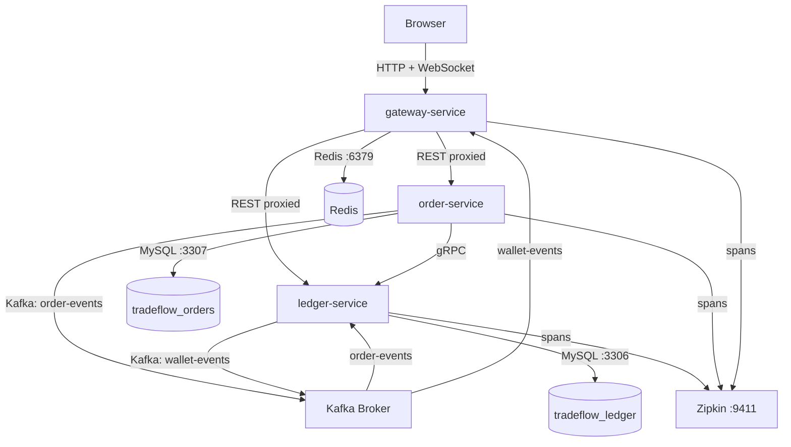

# TradeFlow

A distributed e-commerce and financial settlement engine built on Java 21,
Spring Boot 3, gRPC, Kafka, and MySQL.

[](https://github.com/DominiK037/tradeflow/actions/workflows/ci.yml)
[](https://openjdk.org/projects/jdk/21/)
[](https://spring.io/projects/spring-boot)
[](LICENSE)

---

## What it is

A multi-service backend handling a full e-commerce transaction lifecycle — order
placement, fund reservation, double-entry ledger settlement, real-time wallet events.

Three bounded contexts: 

- `ledger-service` owns all monetary state
- `order-service` owns the order lifecycle
- `gateway-service` handles auth, rate limiting, and WebSocket push. 
- Services talk gRPC (Protobuf) internally, Kafka for events, RSA-signed JWTs
end-to-end.

---

## Engineering Highlights

- **Double-entry ledger** : balances derived from immutable `ledger_entries`, never a mutable balance column
- **Idempotent money movement** : unique idempotency keys make retried requests safe, not double-charged
- **gRPC internal, REST/WebSocket external** : right transport for the right boundary
- **RFC 7807 errors** : one error shape (`ProblemDetail`) across every REST endpoint
- **Centralized error mapping** : one domain exception hierarchy maps to both RFC 7807 (REST) and gRPC `Status` (`@GrpcAdvice`)

---

## Architecture



**Communication model:** 

- Synchronous over gRPC (HTTP/2 + Protobuf) for fund reservation
between order-service and ledger-service — a point-in-time financial check that must block
until complete. 
- Asynchronous over Kafka for all event-driven flows — order confirmation,
wallet settlement, and WebSocket push.

**Data ownership:** strict. No service reads from another service's database schema.

- ledger-service owns `tradeflow_ledger`
- order-service owns `tradeflow_orders`.
- gateway-service has no MySQL — it is a stateless routing layer backed by Redis.

---

## Service Stack

| Service | Stack |
|---|---|
| `ledger-service` | Spring MVC · Spring Data JPA · Flyway · gRPC server · Kafka consumer/producer · OAuth2 Resource Server |
| `order-service` | Spring MVC · Spring Data JPA · Flyway · gRPC client · Kafka producer · Transactional Outbox · Resilience4j |
| `gateway-service` | Spring WebFlux · Spring Cloud Gateway · Redis reactive · JWT issuance (RSA) · WebSocket · Kafka consumer |
| `tradeflow-proto` | Protobuf 3 · gRPC Java stubs · single source of truth for all inter-service contracts |

---

## Getting Started

**Prerequisites:** Java 21+, Maven 3.9+, Docker

```bash
git clone https://github.com/sde-rushikesh-khedkar/tradeflow.git
cd tradeflow
```

Start local infrastructure (MySQL ×2, Redis, Kafka KRaft, Zipkin):

```bash
docker-compose up -d
```

Build and test all modules:

```bash
mvn clean install                                              # compile + unit test + package
mvn verify                                                     # unit + integration + Jacoco 85% gate
```

Run a single service module:

```bash
mvn test -pl ledger-service                                    # unit tests only
mvn verify -pl ledger-service                                  # unit + integration + coverage gate
mvn test -pl ledger-service -Dtest=LedgerEngineTest           # single class
```

---

## Contributing

### Branch naming

```
feature/<task-id>-<slug>    →  merges into dev via squash merge
chore/<slug>                →  branches off dev, merges back to dev
fix/<slug>                  →  branches off dev, merges back to dev
dev                         →  integration branch — merges into main when phase is complete
main                        →  stable, protected, squash merge only
```

---

## License

MIT © [Rushikesh Khedkar](https://github.com/DominiK037)
